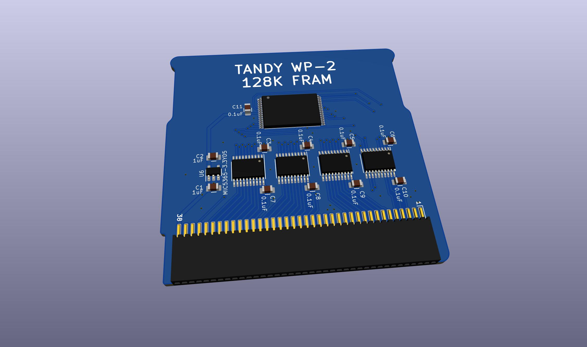

# Expansion IC-Card for TANDY WP-2, TANDY WP-3, Citizen CBM-10WP

The TANDY WP-2 has an expansion slot that accepts "IC Cards" that may be either RAM up to 128K or ROM up to 256K. Here are cards to fit that slot, a RAM card and a ROM card, a programming adapter to program the ROM card, and a breakout card to allow connecting the bus to a breadboard.

All versions of this card must be made from PCB that is 1.2mm or thinner.

There is an optional cover you can 3d-print and glue to the card to protect the components and fill the slot so the card doesn't move.

Gerbers and STLs are in [releases](../../releases/)

----

## RAM CARD  
<!-- [RAM card PCB from OSHPark]() (Select 0.8mm PCB thickness)  -->
[RAM card PCB from PCBWAY](https://www.pcbway.com/project/shareproject/WP_2_RAM_IC_Card.html)  
IMPORTANT, when ordering the PCB:  
* Select **1.2mm** PCB thickness  
* Select **ENIG** copper finish  
* Add this note: "**Bottom solder mask full cover.**"

[RAM card BOM from DigiKey](https://www.digikey.com/short/5wtbz75z)  

  
  
  
  
  

----

## ROM CARD  
There are no known rom images for any rom cards. Don't bother building one of these unless you are trying to create a rom from scratch.

<!-- [ROM card PCB from OSHPark](https://oshpark.com/shared_projects/F9gte3be) (Select 0.8mm PCB thickness)  -->
[ROM card PCB from PCBWAY](https://www.pcbway.com/project/shareproject/WP_2_ROM_IC_Card.html) (Select 1.2mm PCB thickness)  

[ROM card BOM from DigiKey](https://www.digikey.com/short/zn95jj)

  
  

----

## Programming Adapter
The programming adapter supports both ROM and RAM cards.  
Use with a standard eprom programmer such as TL-866.  

[Programming Adapter PCB from OSHPark](https://oshpark.com/shared_projects/TkzNwgho)  
[Programming Adapter PCB from PCBWAY](https://www.pcbway.com/project/shareproject/TANDY_WP_2_IC_Card_Programming_Adapter.html)

[Programming adapter BOM from DigiKey](https://www.digikey.com/short/v2r3pqp4)

In addition to soldering the pins to the PCB, also make a male jumper for the write-enable contacts on the card.  
Cut a pair of pins off the leftover 2.54mm pin header, and solder-blob the two pins together on the short side.  
There is a spot to stow the jumper on the programming adapter when not in use.  

  
  
  
  

### To program the ROM card

Insert the male jumper into the write-enable holes on the card.

Set all 4 jumpers on the programming adapter to ROM.

Example using a TL-866 programmer to write a file named `rom.bin` to the ROM card:  
`minipro --device SST39SF020A --write rom.bin`

<!-- old version of the breakout card also had a footprint for the rom chip and some extra pins to enable/disable it -->
<!-- current breakout card no longer has that, this is just for reference -->
<!-- 
### To program the Breakout/ROM card

Same as for ROM card except:

Install a jumper from /CE1 to /CE_IC on the card.  
Install a jumper from R/W to /WE_IC on the card.  (This one takes the place of the male jumper on the normal rom card above)  
Remove jumper from  GND to /DET on the card.  
-->

### Reading/Writing the RAM card

Set all 4 jumpers on the programming adapter to RAM.

Examples using a TL-866 programmer (628128 is a generic part number for the SRAM on the card):  
`minipro --skip_id --device 628128 --read ram.bin`  
`minipro --skip_id --device 628128 --write ram.bin`  

----

## BREAKOUT CARD

[Breakout PCB from OSHPark](https://oshpark.com/shared_projects/4spvX9oV) (Select 0.8mm PCB thickness)  
[Breakout PCB from PCBWAY](https://www.pcbway.com/project/shareproject/TANDY_WP_2_IC_Card_Breakout.html) (Select 1.2mm PCB thickness)  

[Breakout card BOM from DigiKey](https://www.digikey.com/short/7f55bw00)  

  
  
  

<!--   NOT VERIFIED
## FRAM CARD

  
  

BOM: https://www.digikey.com/short/hzpzbwz3  
-->

----

## MRAM 512K
WIP - WIP - WIP  
NOT TESTED

RAM card without a battery!

This card is expensive. The MRAM chip is $34 by itself, and the 38 pin connector is $10, plus all the rest.  
But this provides 4 128K banks in a single card, and preserves the data without a battery to leak, die, corrode, get shorted from scratched traces on the pcb bottom, etc.  

The parts are not all available from any single supplier.  
The closest is, Mouser has everything but the 38-pin connector, but they do have 39, 43, 50-pin versions in stock which you could cut and sand down.

DigiKey has the exact 38-pin connector in stock, but does not have the 20-bit level-shifter in single quantities.

To get everything in one shot from Mouser, copy the 38-pin connector part number from the cart below ("SMS-138-01-G-S")  
and change "138" to "139", and search that. If that is available, just get one of those instead.  
If that is not available, try "140" and so on up to 150. Some odd numbers like 139 and 143 are actually in stock while the more intuitive "140" (40-pin) is not, so that's why you start at 139 and try each individual count up from there even though they are unusual numbers.
You will have to cut the excess pins off the connector, and the connector is not designed to break away cleanly like that, and the space between the pins is tiny, so it requires some care.
Cut right in the middle of the 39th pin, don't try to cut between 38 and 39. And then very carefully and lightly sand down the rough end just until the little half-walls are almost gone, without touching the thin wall between the pins.  
The wall between pins is PAPER THIN, and the connector is $10 for a single one. Stop sanding as soon as the connector can fit into the PCB.

BOM from Mouser: https://www.mouser.com/ProjectManager/ProjectDetail.aspx?AccessID=CDF549B87B

There are two versions of 3d-printable cover available, with different ways to handle the bank-select switch.  
The default version has a separate moving part to move the switch, but it's tiny and a little finnicky to print and clean up and make fit.  
The "dish" version just has a dish shaped concave opening around the switch so you can finger it directly the same as with no cover. But this can be difficult to print cleanly because of the overhang.

  
  
  
  

----

# Reference Material
[WP-2 Owner & Service Manuals](https://archive.org/search.php?query=Tandy%20WP-2)  
Card slot signals & usage: Service Manual 8-2, C-3.  
Executable "RUN" files: Service Manual 4-16, D-1.  

### Connector:  
[Original Connectors](ref/JC20-B38S-F1.pdf)  
Datasheet for both the slot in the computer and the connector in the card.  

You can't get the real connector any more, but you can get a generic socket header which fits the pins.  
The pins inside the card slot are 1 row x 38 pins, 1.27mm pitch, 6.0mm long

SAMTEC 8.5mm Pin Socket  
<https://duckduckgo.com/?q=SMS-138-01>  
<https://www.digikey.com/en/products/detail/samtec-inc/SMS-138-01-G-S/9773732>  
<https://www.mouser.com/ProductDetail/Samtec/SMS-138-01-G-S>  

There are much less expensive generic female 1.27mm pin headers on ebay and aliexpress etc, but they don't work for this. Sorry :/ The metal parts inside the cheap connectors aren't held in place accurately enough, and the pins in the WP-2 hit the edges of the metal parts in female sockets, and no amount of wiggling gets all 38 pins to line up and let the card insert. And *trying* just risks damaging the pins inside the WP-2. So, the Samtec socket is both deep enough to take the 6 mm pins, and is manufactured to tight enough tolerances that the pins slot right into the socket with no problems.

### RAM chip:  
Compatible Specs: SRAM, 128Kx8, 5v, Parallel, TSOP-32 (8x20mm) or sTSOP-32 (8x14mm)  
Several parts are compatible. Several examples are listed in the schematic, and the BOM links include a compatibe part.  Here are some pre-loaded searches:  
[DigiKey](https://www.digikey.com/short/zw38nv)  
[Mouser](https://mou.sr/2GcUWHl) (many of the pictures are wrong, so ignore the pictures)  

### ROM chip:  
Compatible Specs: FLASH, 256Kx8, 5v, Parallel, TSOP-32 (8x20mm) or sTSOP-32 (8x14mm)  
As with the SRAM, several parts are compatible. A few example part numbers are listed in the schematic, and the BOM links include a compatible part.  

### Notes about some of the card slot signals:  

Pin 2, /DET Card Detect: WP-2 uses this to detect the type of card. The pin is pulled up to VDD inside the WP-2. A RAM card connects this pin to GND, which tells the WP-2 that it is a RAM card. A ROM card leaves this pin not connected, which means it will be pulled high by the pullup resistor inside the WP-2, which tells the WP-2 that it is a ROM card.

Pin 3, CE2, active-high chip-enable: CE2 is just wired directly to VDD inside the WP-2. The cards in this repo don't use this pin.

Pin 15 -> RA5 -> IC5 pin 66, "S1"  
Pin 16 -> RA5 -> IC5 pin 67, "S2"  
Pin 36 -> RA5 -> IC5 pin 68, "S3"  

RA5 is 100k pullup to VDD.  
IC5 is a gate array with unknown programming.  
The service manual says the original IC Cards have no connections on any of these pins.  
It is unknown if the WP-2 does anything at all with these pins.  
The S1, S2, S3 labels come from a schematic in the service manual. They are not mentioned anywhere else.

Pin 17, A17: Only used for ROM. the WP-2 only supports up to 128K in a RAM card.

Pin 37, BCHK/Vchk, Battery Voltage Check: Unknown usage, but probably originally intended for the WP-2 (or the Citizen CBM-10WP) to detect the level of the battery in a RAM card. The schematic on service manual page 8-2 doesn't show Vchk connecting to anything, and I also cannot find anything anywhere on the motherboard that has continuity with this pin. Other similar machines had a pin that was used for the host machine to read the level of the battery on a RAM card. See the VBB pin in [Atari Portfolio Technical reference Guide, page 11](https://archive.org/details/atariportfoliotechnicalreferenceguide1989/page/n10/mode/1up)  These cards (except the breakout card) don't connect this pin.

# TODO
CamelFORTH on ROM?  
But how to construct rom image? Same as RAM?

Document how to export gerbers for JLCPCB/PCBWAY/etc  

Document how to select the right manufacturing options in JLCPCB/PCBWAY/etc  
* 1.2mm pcb thickness
* ENIG for the RAM card

Add a 5v power output to power a [MounT](https://github.com/bkw777/MounT)?
