# Expansion IC Card for TANDY WP-2

NOT YET TESTED - FOR REFERENCE ONLY UNTIL VERIFIED  
Status: 2020-09-28 waiting for PCB and carrier to arrive  
Current/best version is v003-s  

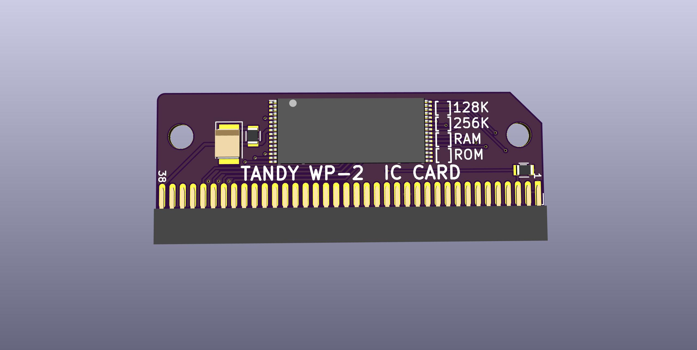  
  
  
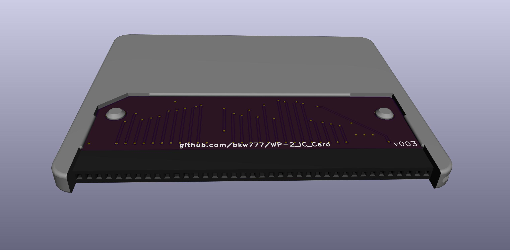  
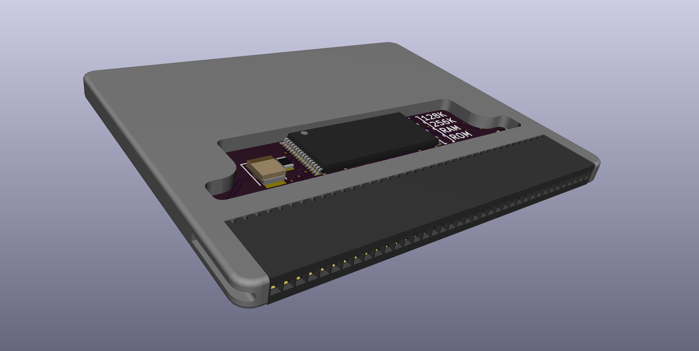  
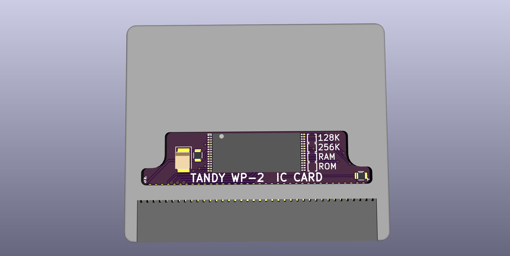  
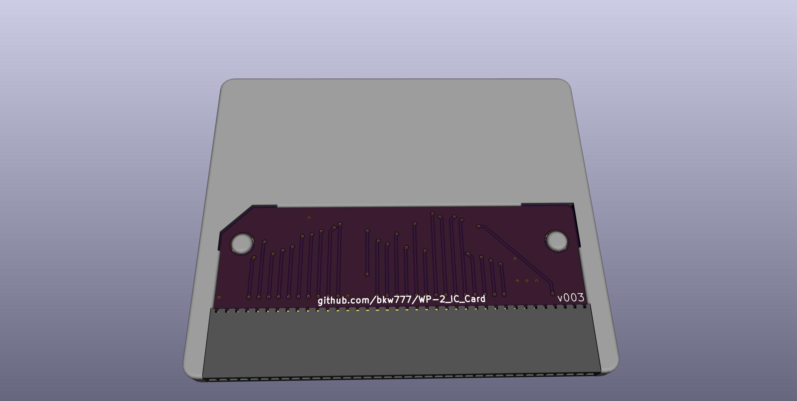  
  
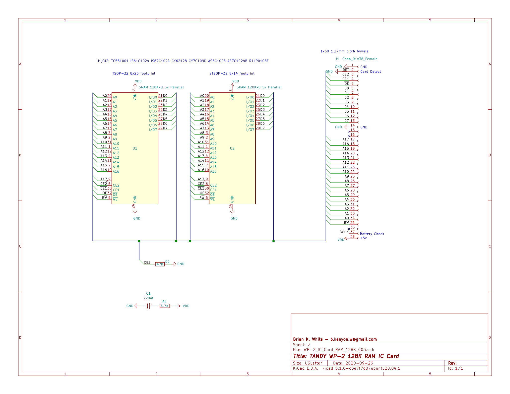  

3d-printed carrier  
[Carrier v003-s at Shapeways](http://shpws.me/Si2L)  

PCB (Select 0.8mm pcb option at checkout)  
[PCB v003 at OSHPark](https://oshpark.com/shared_projects/5IXVjO6N)  

SRAM  
[DigiKey](https://www.digikey.com/short/zw38nv)  
[Mouser](https://mou.sr/2GcUWHl) (many of the pictures are wrong, so ignore the pictures)  

SAMTEC 8.5mm Pin Socket (for v003-s)  
<https://duckduckgo.com/?q=SMS-138-01>  
<https://www.digikey.com/en/products/detail/samtec-inc/SMS-138-01-G-S/9773732>  
<https://www.mouser.com/ProductDetail/Samtec/SMS-138-01-G-S>  

GENERIC 4.3/4.4mm Pin Socket (for v001 and v003-g)  
Search for 1.27mm, female, single row, 40 or 50 pins, the 4.3mm style.
[Search ebay](https://ebay.com/sch/i.html?_nkw=1.27mm+header+female)
[Search aliexpress](https://www.aliexpress.com/wholesale?SearchText=1.27mm+female)  
Example: <https://www.aliexpress.com/item/32854195543.html>

# Reference
[WP-2 Manual](https://archive.org/search.php?query=Tandy%20WP-2)  
Contains schematics, pinout, and mechanical drawings of the card and slot.

[Original Connectors](ref/JC20-B38S-F1.pdf)  
Datasheet for both the slot in the computer and the connector in the card.

You can't get the real connector any more, but you can get a generic 1.27mm pitch 1x50 socket header which fits the pins.  
The card socket has 38 pins, and generic sockets have 40 or 50 pins. The extra socket pins can just be cut off.  
The pins inside the WP-2 are 6.0mm long, and the generic socket is only 4.4mm deep, so the PCB is recessed so that when the card is inserted into the WP-2 as far as possible, the pins only go 4.4mm into the socket.

Compatible RAM chips: SRAM 128Kx8 5v Parallel, TSOP-32 or sTSOP-32  

# TODO
See if 256K RAM works:  
[256Kx8 SRAM](https://www.mouser.com/ProductDetail/Alliance-Memory/AS6C2008A-55STIN)  
The WP-2 manual states that the max RAM card supported is 128K, and the max ROM card is 256K.  
There is an A17 pin in the slot. Try connecting the A17 line and just see if the WP-2 firmware actually recognizes 256K RAM.  

ROM:  
CamelFORTH on ROM  
But how to construct rom image?  

# Variations / WIP / History  
##v003 (v003-g, v003-s, v003-b):  
* "Captain Crunch" (smaller pcb)  
* keep-alive cap  
* attached A17 for possible 256K  
* redesign carrier to remove un-printable thin walls  

###v003-s = Samtec pin header SMS-138-01-x-x  
Socket header has different dimensions so carrier is different  
Looks the same but it's not.  
PCB is the same v003 PCB  
This socket is more expensive but fits better  

###v003-g = generic, the carrier fits the generic/aliexpress/ebay pin header  
[Carrier v003-g at Shapeways](http://shpws.me/Sib8)  
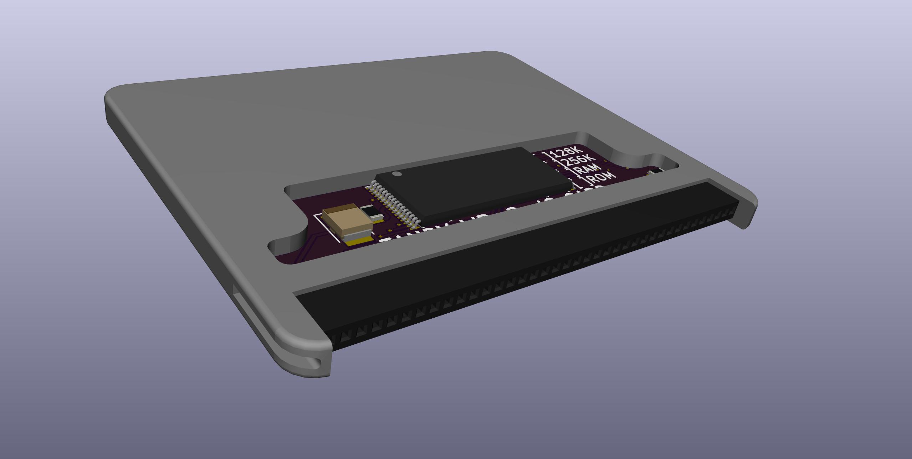  
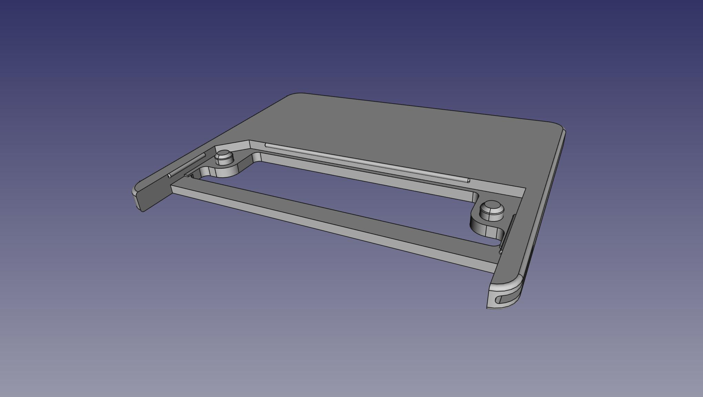  
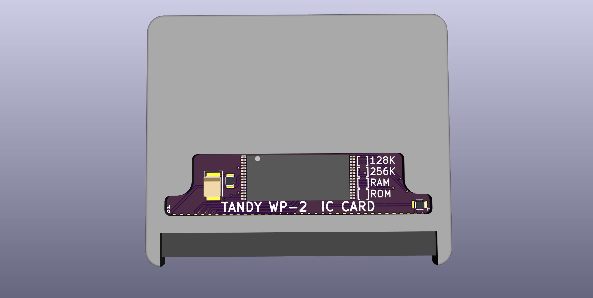  
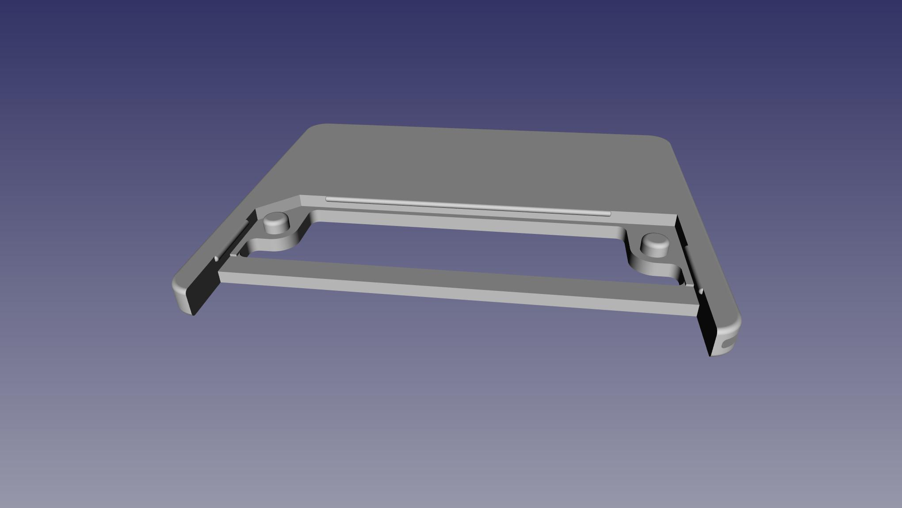  
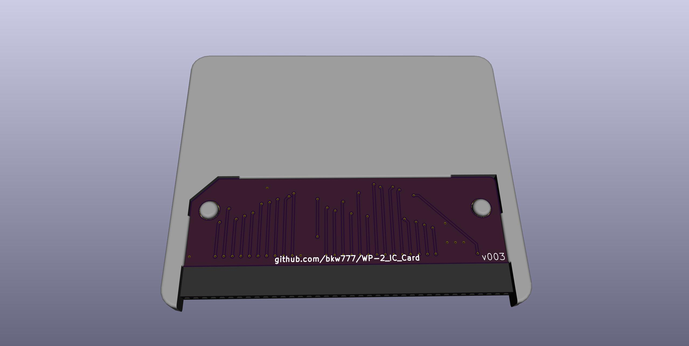  

###v003-b = bare pcb, no carrier, normal 1.6mm pcb  
Without a carrier to fill the slot and ensure the pin header is aligned, it's possible to damage the pins in the slot. Use with care.  
Same v003 schematic  
[PCB v003-b at OSHPark](https://oshpark.com/shared_projects/ZoP4Znqc)  
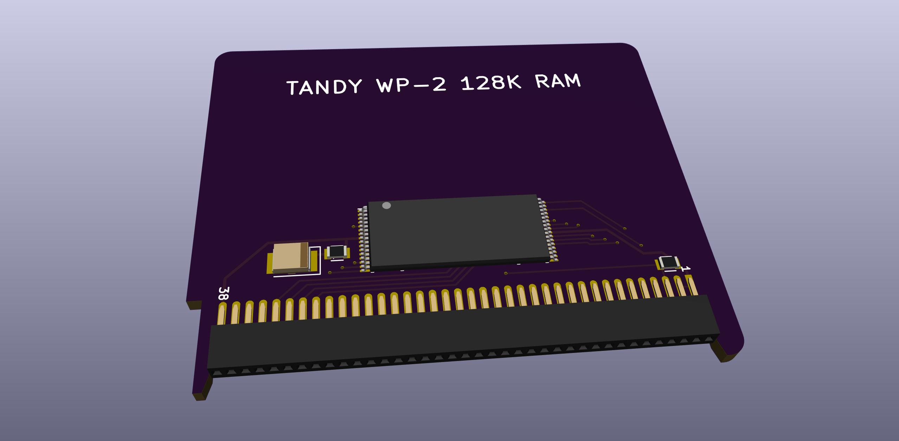  

##v002  
* v002 is like Highlander 2, it never happened, doesn't exist, and we don't talk about it.  
* Alternative pcb & carrier design to avoid unprintable thin walls around the pin header. Technically meets printability specs, but the big flat 0.7mm sheets are probably pushing the limit too far to actually get good results.  
  
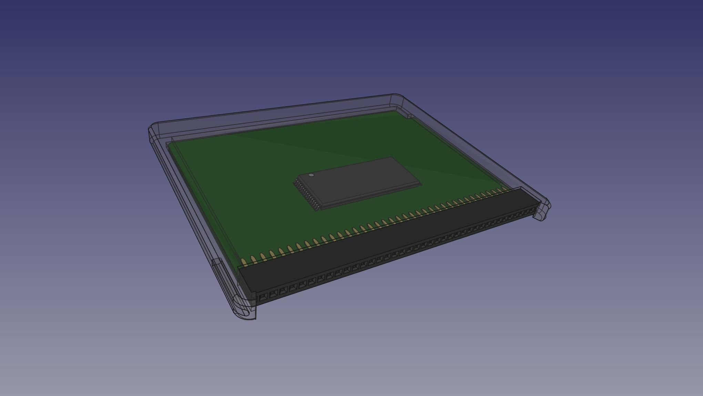  
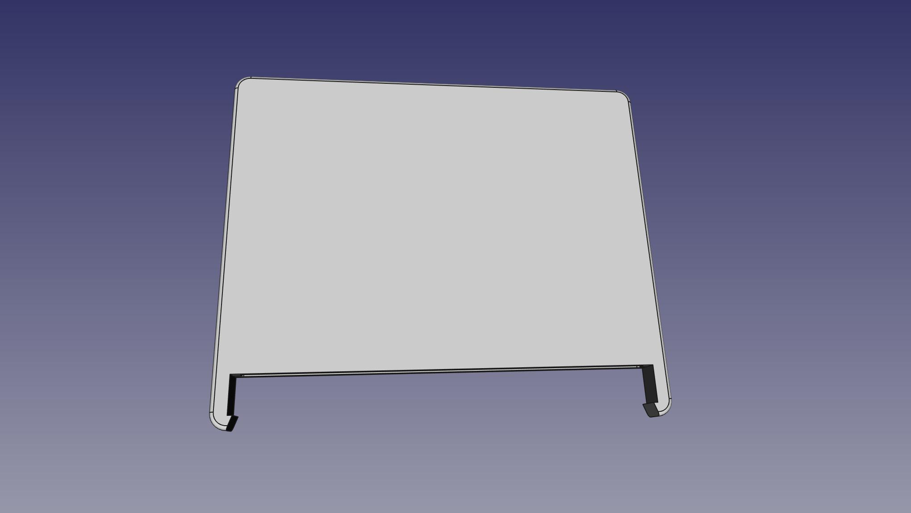  
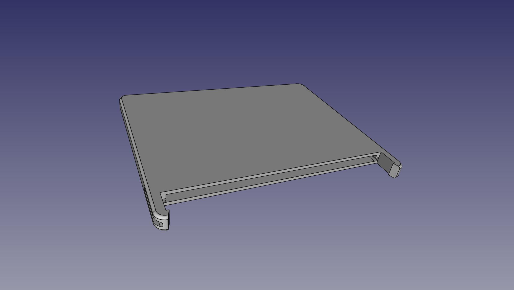  

##v001  
[Carrier v001 at ShapeWays](http://http://shpws.me/ShPo)  
[PCB v001 OSHPark](https://oshpark.com/shared_projects/7Gr3WoFh)  
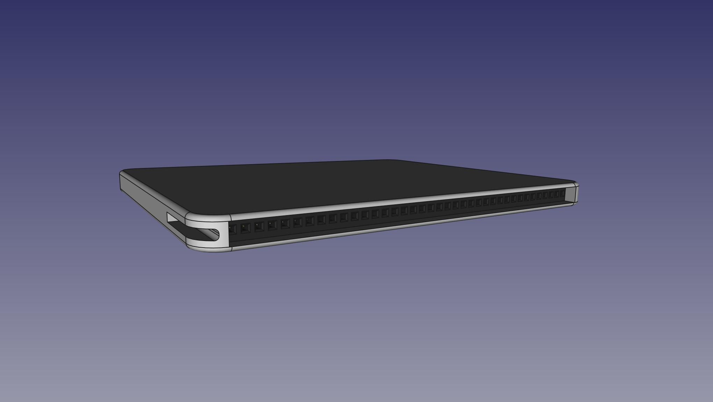  
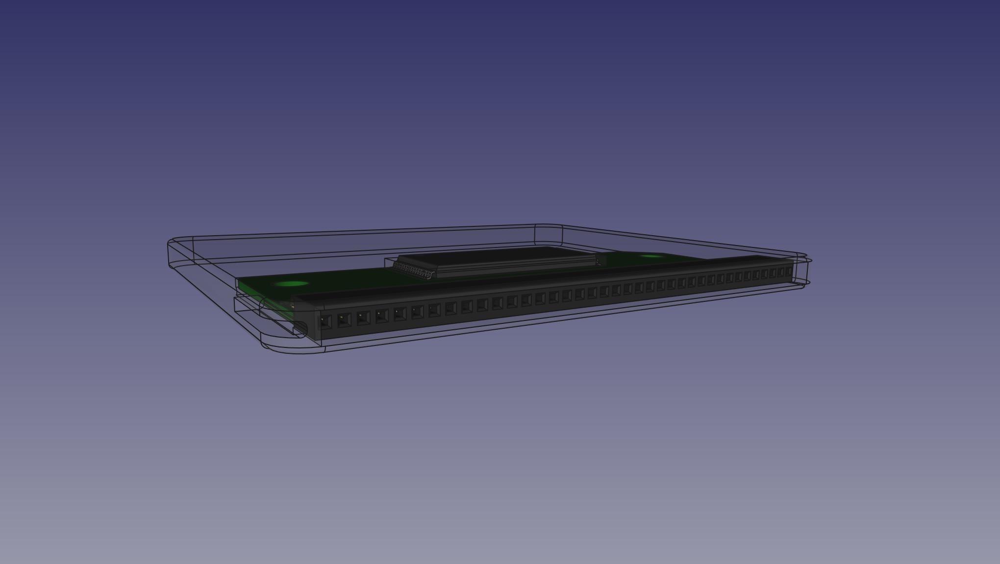  
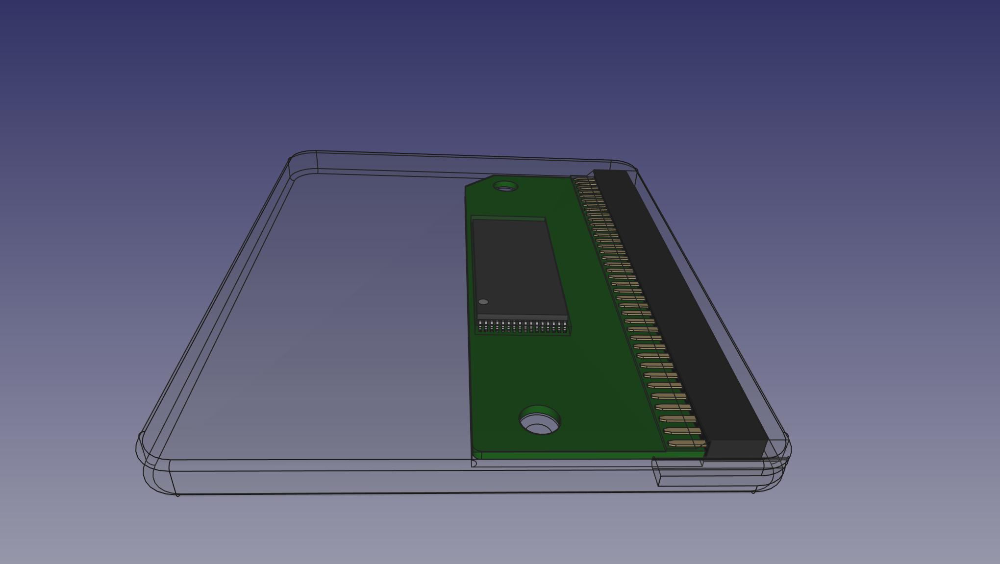  
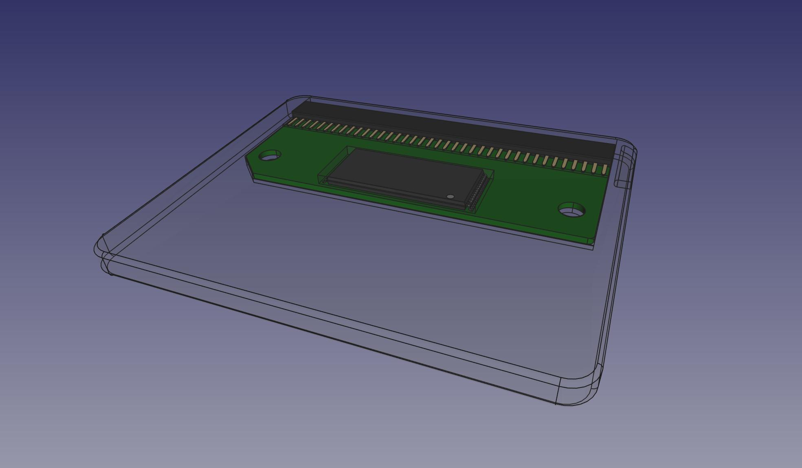  
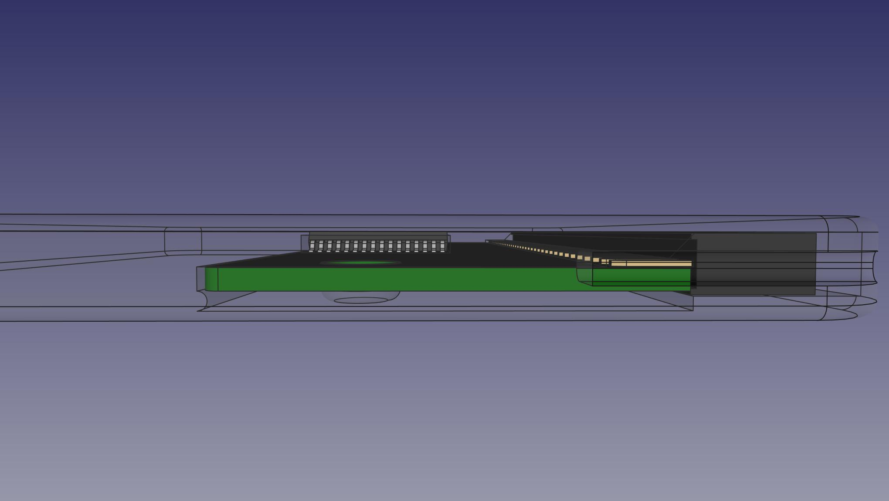  
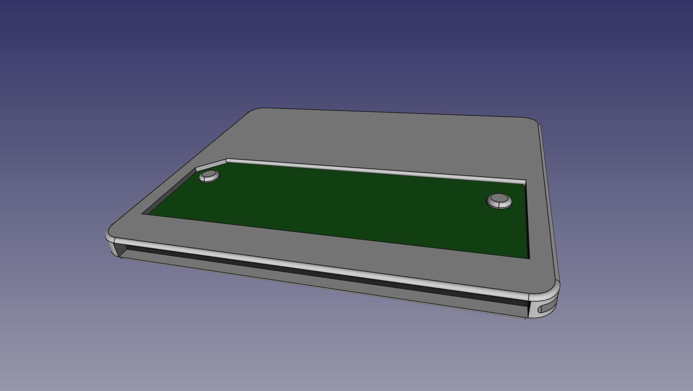  
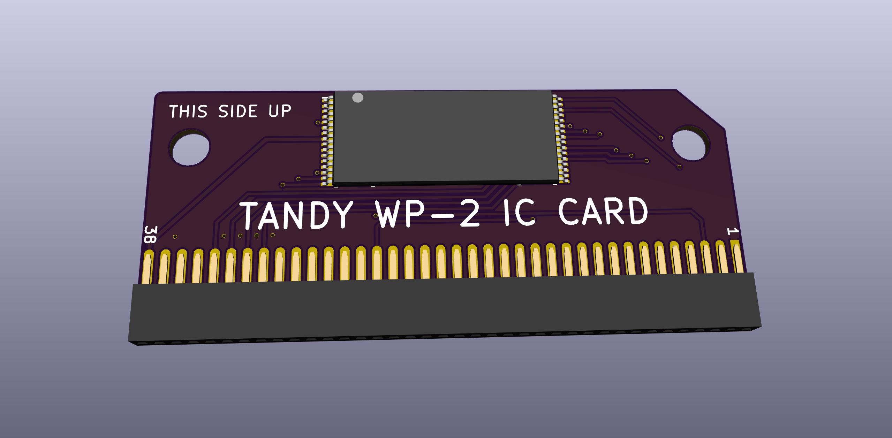  
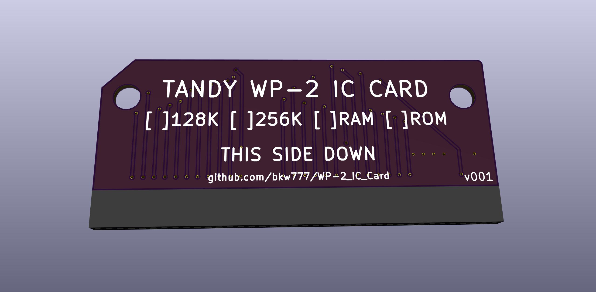  
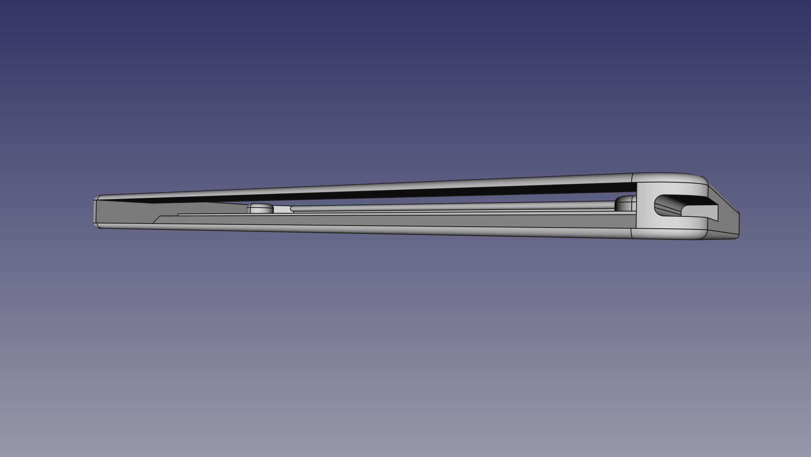  
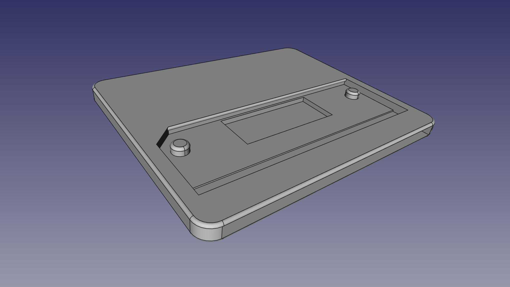  
  

