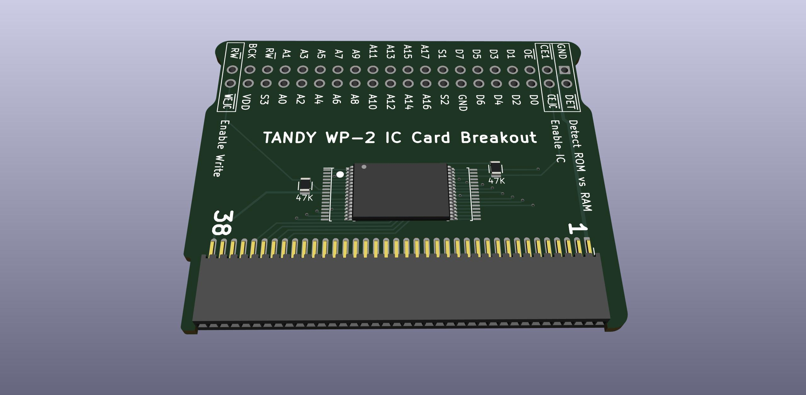
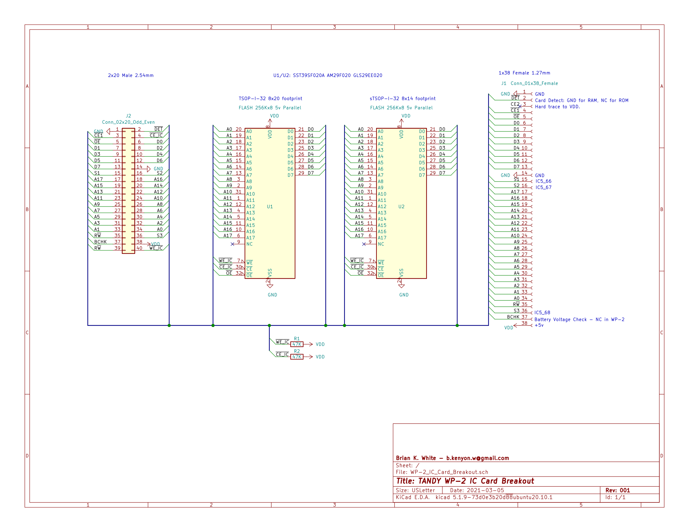

# Expansion IC Card for TANDY WP-2

The TANDY WP-2 has an expansion slot that accepts "IC Cards" that may be either RAM or ROM, up to 128K RAM, up to 256K ROM. Here are two cards to fit that slot, a RAM card and a ROM card, and a programming adapter to program the ROM card. The RAM card includes a battery backup.

All versions of this card must be made from PCB that is 1.2mm or thinner.

## RAM CARD  

  
  

[RAM card PCB from OSHPark](https://oshpark.com/shared_projects/viS1JOJY) (Select 0.8mm PCB thickness)  
[RAM card PCB from PCBWAY](https://www.pcbway.com/project/shareproject/WP_2_RAM_IC_Card.html) (Select 1.2mm PCB thickness, ENIG surface finish, add note "Bottom solder mask full cover")

[RAM card BOM from DigiKey](https://www.digikey.com/short/hfwn58jq)

### Reading/Writing the RAM card outside of the WP-2
No one needs this, because it only provides raw chip access not high level files/filesystem access. But, for hacking/experimenting, there is a RAM card programming adapter included which can be used to read and write the RAM card outside of the WP-2.  
To build one, use the same BOM as the ROM card programming adapter below.  

Examples using a TL-866 programmer (628128 is a generic part number for the SRAM on the card):  
`minipro --skip_id --device 628128 --read ram.bin`  
`minipro --skip_id --device 628128 --write ram.bin`  

For reading only, the ROM card programing adapter can also be used.  
To use the ROM card programming adapter to dump a RAM card, force the programmer to assume the device is a 128K ROM card, meaning a 29F010.  
Example for a TL-866 programmer using the "minipro" util, to dump the contents of a RAM card to a file named `ram.bin`:  
`minipro --skip_id --device SST39SF010A --read ram.bin`

## ROM CARD

  
  

[ROM card PCB from OSHPark](https://oshpark.com/shared_projects/F9gte3be) (Select 0.8mm PCB thickness)  
[ROM card PCB from PCBWAY](https://www.pcbway.com/project/shareproject/WP_2_ROM_IC_Card.html) (Select 1.2mm PCB thickness)  

[ROM card BOM from DigiKey](https://www.digikey.com/short/zn95jj)

### ROM Card Programming Adapter
Use with a standard eprom programmer such as TL-866, to write to the ROM card.  

  
  
  

[ROM Card programming adapter PCB from OSHPark](https://oshpark.com/shared_projects/tvMoYMrG)  
[ROM Card programming adapter PCB from PCBWAY](https://www.pcbway.com/project/shareproject/WP_2_IC_Card_ROM_programming_adapter.html)

[Programming adapter BOM from DigiKey](https://www.digikey.com/short/tvqjhh21)

In addition to soldering the pins to the PCB, also make a male jumper for the write-enable contacts on the card.  
Cut a pair of pins off the leftover 2.54mm pin header, and solder the two pins together on the short side.  
There is a spot to stow the jumper on the programming adapter when not in use.  

To program the ROM card, insert the jumper into the write-enable holes on the card.

Example using a TL-866 programmer to write a file named `rom.bin` to the ROM card:  
`minipro --device SST39SF020A --write rom.bin`

## BREAKOUT CARD

  
  

[Breakout PCB from OSHPark](https://oshpark.com/shared_projects/4spvX9oV) (Select 0.8mm PCB thickness)  
[Breakout PCB from PCBWAY](https://www.pcbway.com/project/shareproject/TANDY_WP_2_IC_Card_Breakout.html) (Select 1.2mm PCB thickness)  

[Breakout card BOM from DigiKey](https://www.digikey.com/short/7f55bw00)  

A few of the pins on the breakout pin header can be used both as connections to a breadboard or logic analyser, or with a jumper to short it to a neighboring pin.

GND - /DET  : The /DET pin is a signal from the card to the WP-2. Inside the WP-2, /DET has a pullup. If the card shorts /DET to ground, this tells the WP-2 that the card is a RAM card. If the card does not connect /DET to anything, that tells the WP-2 that the card is a ROM card.  

/CE1 - /CE_IC  :  /CE1 comes from the WP-2. /CE_IC goes to the /CE pin on the on-board chip. The /CE1 pin can be connected to a breadboard like all the other signals, and the on-board chip will be disabled. Or a jumper can be installed to connect these two pins and that enables the on-board chip, and the card acts like an ordinary ROM card.  

R/W - /WE_IC  :  R/W comes from the WP-2. /WE_IC goes to the /WE pin on the on-board chip. A jumper can be installed to connect these two pins to write to the on-board chip using the ROM card programming adapter. The two R/W pins are the same. The R/W pin next to the /WE_IC pin is just a copy to make it possible to install a jumper to /WE on the on-board chip.  

The breakout card can be used a few different ways:  

* As an ordinary ROM card using the on-board chip.  
: /DET open. /WE_IC open. /CE_IC closed.  

* As an ordinary ROM card using the on-board chip, being programmed with the ROM card programming adapter.  
: /DET open. /WE_IC closed. /CE_IC closed.  

* Breakout/emulated ROM card, with the on-board chip disabled and a rom chip or emulator attached via the breakout pins.  
: /DET open. /WE_IC open. /CE_IC open.  

* Breakout/emulated RAM card, with the on-board chip disabled and a ram chip or emulator attached via the breakout pins.
: /DET closed. /WE_IC open. /CE_IC open.  

The S1, S2, and S3 pins are not documented to do anything, but are provided because they are physically connected to something inside the WP-2.  
They are connected to pullup resistors and to a gate array chip with unknown programming.  
The service manual says that the original IC Cards do not connect anything to these pins.  

The BCHK pin is provided because it's not 100% certain whether this pin is physically connected to anything inside the WP-2 or not.  
The service manual clearly labels it "Battery Check" in more than one place, which is a funny way to spell "un-used". However at least one schematic seems to say that the pin isn't connected to anything, and I have not been able to find continuity with anything by physically probing. However, I can't see all parts of the PCB right near that pin, so it's possible there is a trace connected to it.  
It's unknown even if this was intended to be a signal TO the WP-2, or FROM it. So the pin is provided to investigate exactly this.  

The CE2 pin from the IC Card interface is not provided at the breakout header because that pin happens to have no behavior that needs to be either used or investigated.  
CE2 is just a hard trace to VDD inside the WP-2. Not even a pullup that might be overriden, but a solid trace. It doesn't turn on & off under any conditions, it's just a copy of VDD.  
This allowed that spot on the breakout pin header to be used for the /CE jumper which IS useful.  

----

# Reference Material
[WP-2 Owner & Service Manuals](https://archive.org/search.php?query=Tandy%20WP-2)  
Card slot signals & usage: Service Manual 8-2, C-3.  
Executable "RUN" files: Service Manual 4-16, D-1.  

### Connector:  
[Original Connectors](ref/JC20-B38S-F1.pdf)  
Datasheet for both the slot in the computer and the connector in the card.  

You can't get the real connector any more, but you can get a generic socket header which fits the pins.  
The pins inside the card slot are 1 row x 38 pins, 1.27mm pitch, 6.0mm long

SAMTEC 8.5mm Pin Socket  
<https://duckduckgo.com/?q=SMS-138-01>  
<https://www.digikey.com/en/products/detail/samtec-inc/SMS-138-01-G-S/9773732>  
<https://www.mouser.com/ProductDetail/Samtec/SMS-138-01-G-S>  

There are much less expensive generic female 1.27mm pin headers on ebay and aliexpress etc, but they don't work for this. Sorry :/ The metal parts inside the cheap connectors aren't held in place accurately enough, and the pins hit the edges of the female sockets and no amount of wiggling gets all 38 pins to line up and let the card insert. And *trying* risks damaging the pins inside the WP-2, which you really really do not want to do. So, the Samtec connector is both deep enough to take the 6 mm pins, and is manufactured to tight enough tolerances that the pins slot right into the socket with no problems. If you don't want to wait the extra shipping time to get the 38-pin connector from Samtec, DigiKey has the 40-pin version in their own inventory and ships immediately. With a little care you can buy the 40-pin connector and sand it down to 38 pins. Cut the connector right through the middle of the 39th pin with flush cutters, then lightly sand the cut end flat.

### RAM chip:  
Compatible Specs: SRAM, 128Kx8, 5v, Parallel, TSOP-32 (8x20mm) or sTSOP-32 (8x14mm)  
Several parts are compatible. Several examples are listed in the schematic, and the BOM links include a compatibe part.  Here are some pre-loaded searches:  
[DigiKey](https://www.digikey.com/short/zw38nv)  
[Mouser](https://mou.sr/2GcUWHl) (many of the pictures are wrong, so ignore the pictures)  

### ROM chip:  
Compatible Specs: FLASH, 256Kx8, 5v, Parallel, TSOP-32 (8x20mm) or sTSOP-32 (8x14mm)  
As with the SRAM, several parts are compatible. A few example part numbers are listed in the schematic, and the BOM links include a compatible part.  

### Notes about some of the card slot signals:  

Pin 2, /DET Card Detect: WP-2 uses to detect the type of card. The pin has a pullup to VDD inside the WP-2. A RAM card connects this pin to GND, which tells the WP-2 that it is a RAM card. A ROM card leaves this pin not connected, which means it will be pulled high by the pullup resistor inside the WP-2, which tells the WP-2 that it is a ROM card.

Pin 3, CE2, active-high chip-enable: CE2 is just wired directly to VDD inside the WP-2. The cards in this repo don't use this pin.

Pin 15 -> RA5 -> IC5 pin 66, "S1"  
Pin 16 -> RA5 -> IC5 pin 67, "S2"  
Pin 36 -> RA5 -> IC5 pin 68, "S3"  

RA5 is 100k pullup to VDD.  
IC5 is a gate array with unknown programming.  
The service manual says the original IC Cards have no connections on any of these pins.

Pin 17, A17: Only used for ROM. RAM may only go up to 128K. ROM may go to 256K. The RAM card does not connect A17. The ROM card does.

Pin 37, BCHK/Vchk, Battery Voltage Check: Unknown usage. The schematic on service manual page 8-2 doesn't show Vchk connecting to anything, and I also cannot find anything anywhere on the motherboard that connects to the pin. These PCBs don't connect this pin.  

# TODO
CamelFORTH on ROM?  
But how to construct rom image? Same as RAM?

Document how to export gerbers for JLCPCB/PCBWAY/etc  

Document how to select the right manufacturing options in JLCPCB/PCBWAY/etc  
* 1.2mm pcb thickness
* ENIG for the RAM card

Add a 5v power output to power a [MounT](https://github.com/bkw777/MounT) ?
