# Expansion IC Card for TANDY WP-2

Status: 2020-10-20  
Testing is almost done but not complete yet.  
STILL JUST FOR REFERENCE AT THIS TIME  

An earlier RAM version has been tested and verified. The basic circuit works, and all physical/mechanical aspects of the v003 carrier and pcb outline and pin header are settled.
 
Changes from the last-tested version, which need to be proven:  
* Added D1 between VDD from the bus and the rest of the card, to prevent C1 from draining instantly into the WP-2 when the WP-2 is turned off while the card is connected.  
* Hard wire CE2 and change R2 from a pulldown on CE2 to a pullup on /CE1. CE2 is tied to VDD inside the WP-2 not actually switched.

Neither ROM version has been tested yet.  

The ROM programming adapter has not been tested yet.  

The RAM_cap_batt_no_carrier version is new. The battery circuit and physical fit of the battery holder and the alignment of the pin header without any carrier is all untested yet.  

For all of these IC cards, whether the small pcbs in the 3d-printed carrier, or the big pcbs that don't use a carrier,
the PCB must be 0.8mm thick, NOT the standard 1.6mm. On OSHPark, select "[*] 2 oz copper, 0.8mm thickness" at check-out.

The programming adapter may be a standard 1.6mm pcb.

## RAM CARDS

### RAM_cap_carried
RAM card with optional memory power capacitor, small pcb in a 3d-printed carrier.

You may build this two ways:  

Basic: Don't install any components other than the SRAM chip and pin socket. Solder-bridge the D1/SB1 footprint.

Full: Install all components, including a diode on D1/SB1.

Full configuration provides about 10 minutes of memory power from a capacitor while the card is ejected or the WP-2 power is off.

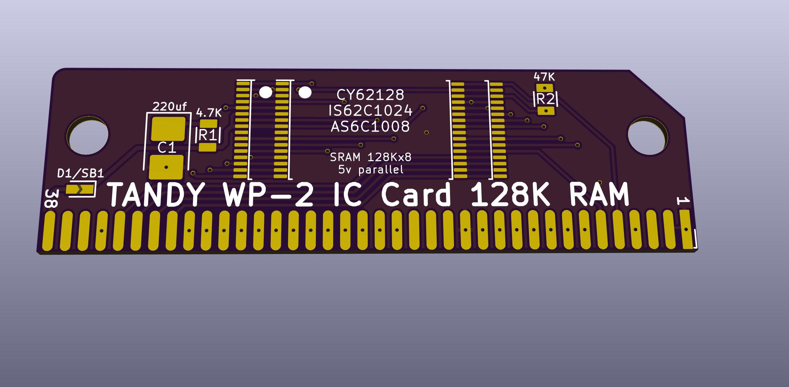  
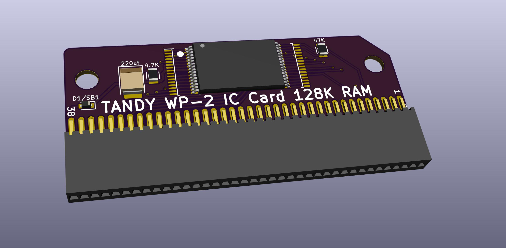  
  
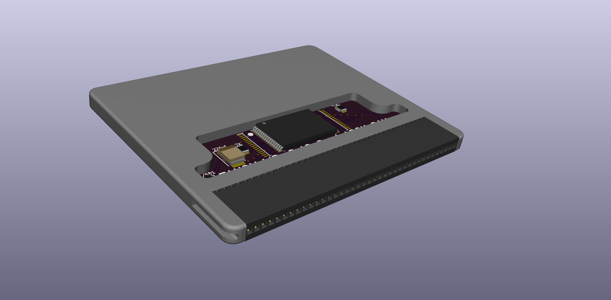  
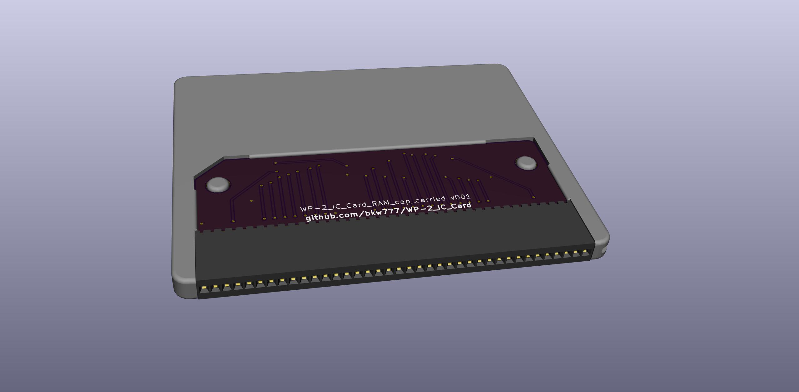  
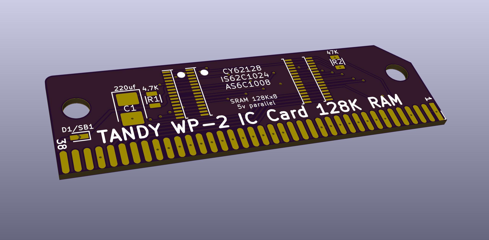  
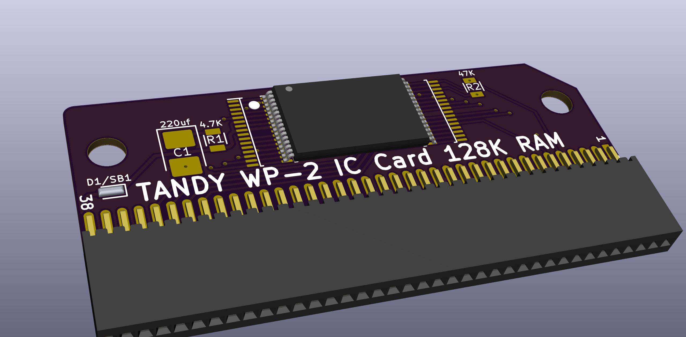  
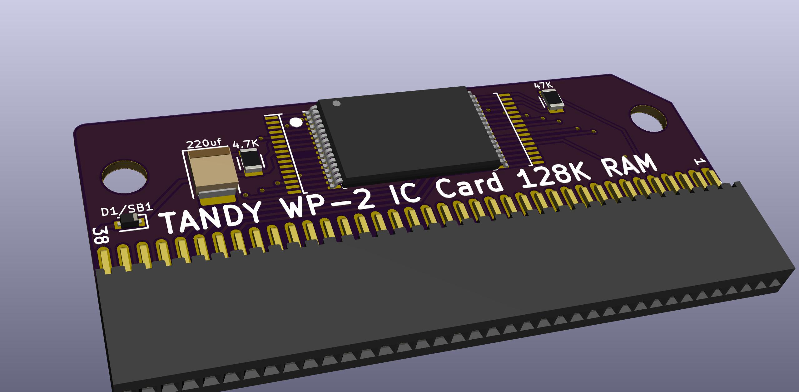  
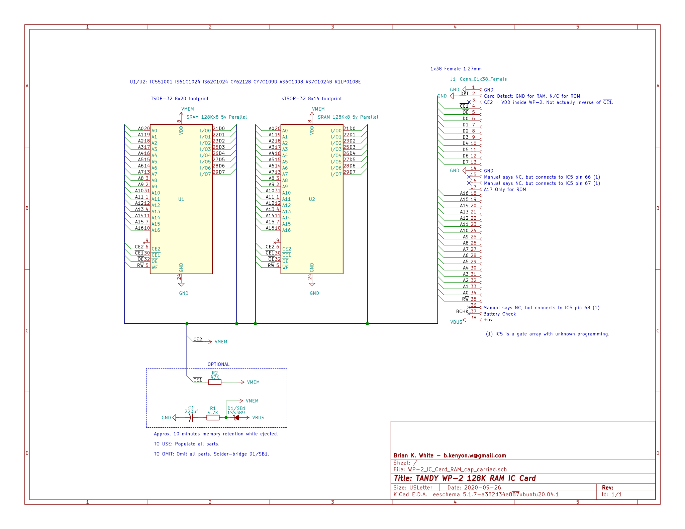  

CARRIER  (RAM and ROM versions both use this same carrier)  
[Carrier v003 at Shapeways](https://shpws.me/Si2L)  

PCB (Select 0.8mm pcb option at checkout)  
[PCB RAM_cap_carried at OSHPark](https://oshpark.com/shared_projects/cFUnqK0A)  

BOM  
[Parts for RAM_cap_carried from DigiKey](https://www.digikey.com/short/zdp7q1)

### RAM_cap_batt_no_carrier
RAM version with optional battery and no 3d-printed carrier.  

You may build this 4 ways:

Basic: Don't install any components other than the SRAM chip and pin socket. Solder-bridge the D1/SB1 footprint.  
Memory is lost immediately when the card is ejected or the WP-2 is turned off.

With cap, no battery: Install C1, R1, R2, and diode on D1/SB1.  
Provides about 10 minutes of memory power.

With battery, no cap: Install battery holder, D2, R2, and diode on D1/SB1.  
Provides about 10 years of memory power, but only while the battery remains connected. Memory is lost immediately if battery is removed.

Full: Install all components, including diode on D1/SB1.
Provides about 10 years of memory power, and about 10 minutes of memory power without the battery.

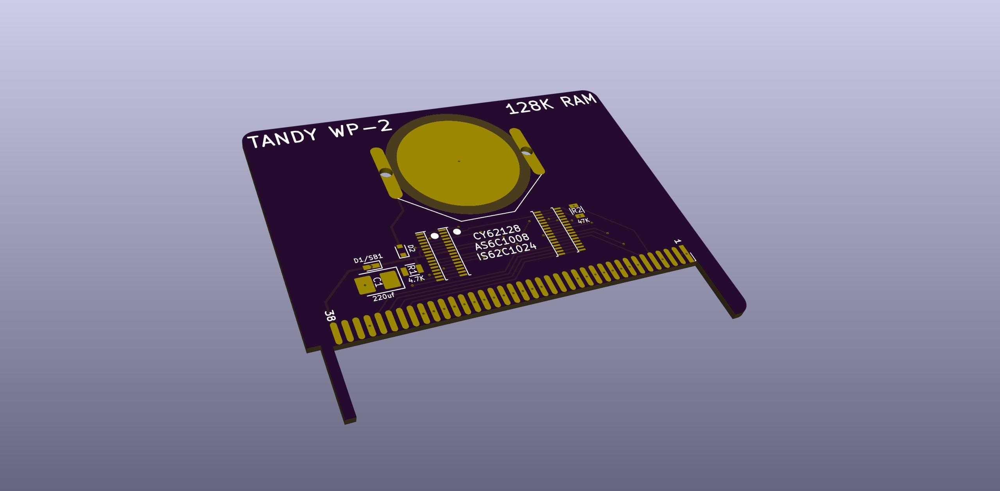  
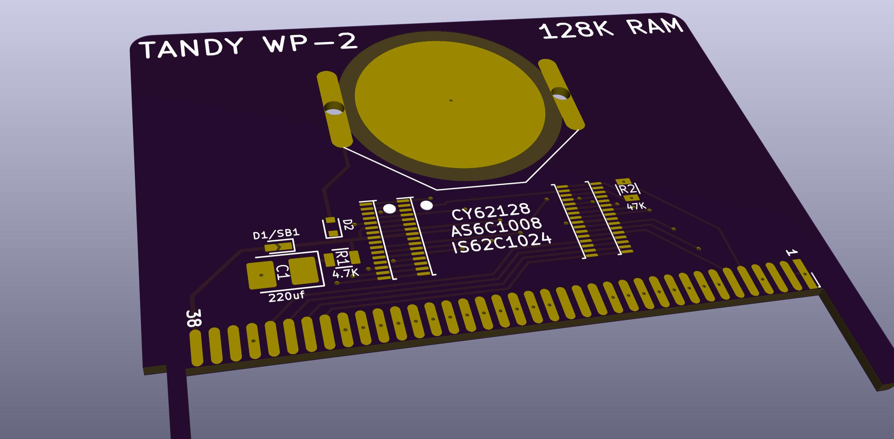  
  
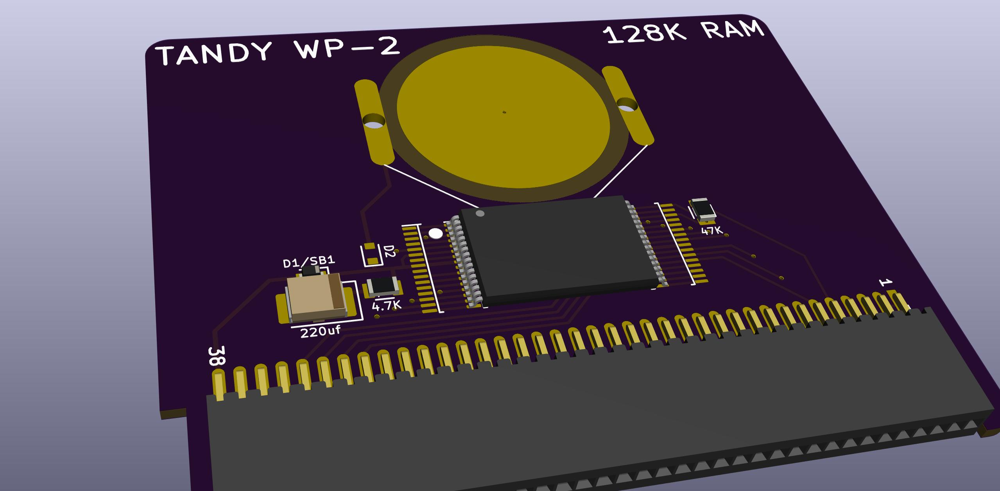  
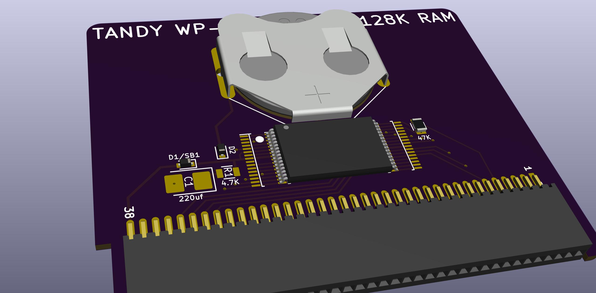  
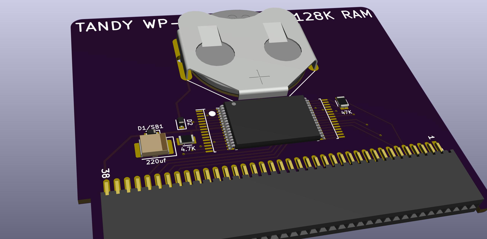  
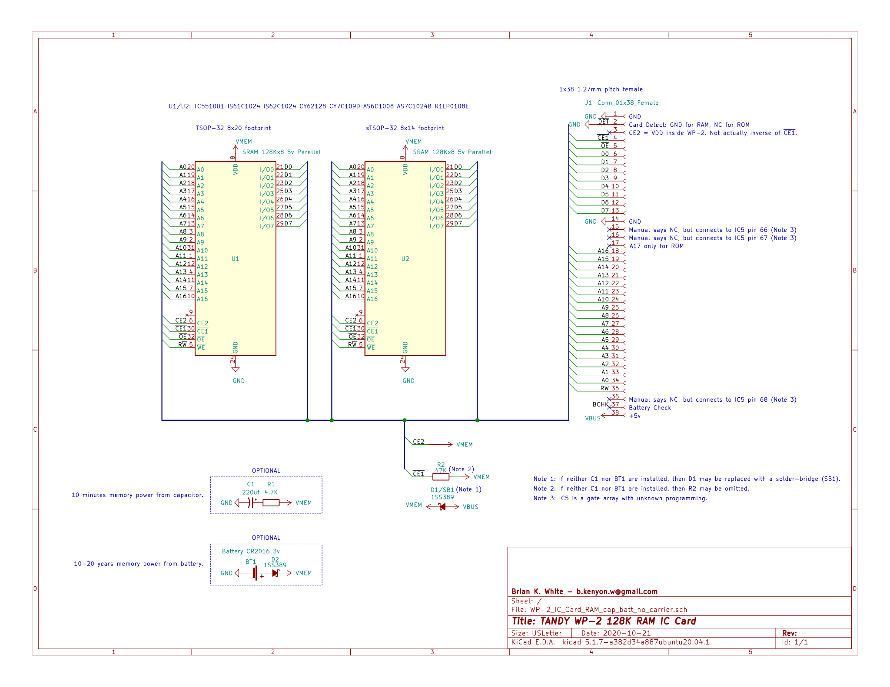  

PCB (Select 0.8mm pcb option at checkout)  
[PCB RAM_cap_batt_no_carrier at OSHPark](https://oshpark.com/shared_projects/GAGxQb9r)  

BOM  
[Parts for RAM_cap_batt_no_carrier at DigiKey](https://www.digikey.com/short/zn0wrr)

## ROM CARDS

### ROM_carried
"ROM" based on a flash chip, which may be written using a matching programming adapter and standard eprom burner.

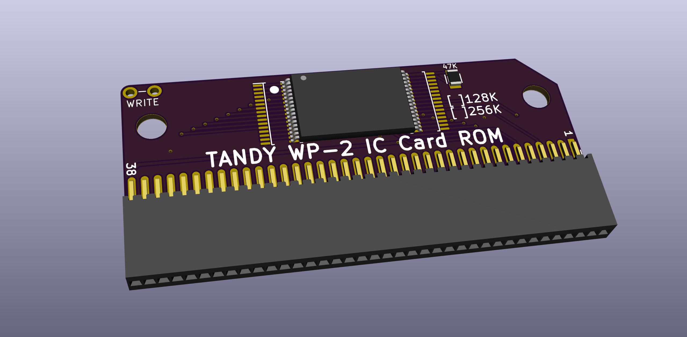  
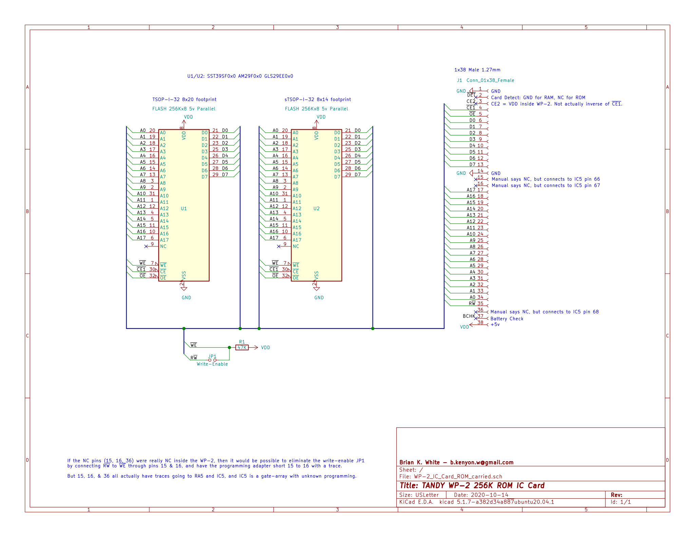  

PCB (Select 0.8mm pcb option at checkout)  
[PCB ROM_carried at OSHPark](https://oshpark.com/shared_projects/v4PaRAEJ)  

BOM  
[Parts for ROM_carried from DigiKey](https://www.digikey.com/short/zn95jj)

### ROM_no_carrier
Same as above but on a big pcb with no carrier, instead of a small pcb in a 3d-printed carrier.
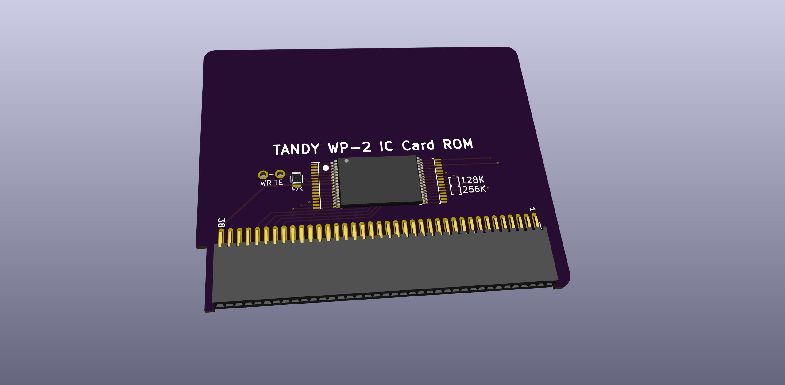  
  

PCB (Select 0.8mm pcb option at checkout)  
[PCB ROM_no_carrier at OSHPark](https://oshpark.com/shared_projects/iJiakYAE)  

BOM  
[Parts for ROM_no_carrier at DigiKey](https://www.digikey.com/short/zn95jj)

## ROM Programming Adapter
Use with a standard eprom programmer such as TL-866, to write either of the ROM cards.

  
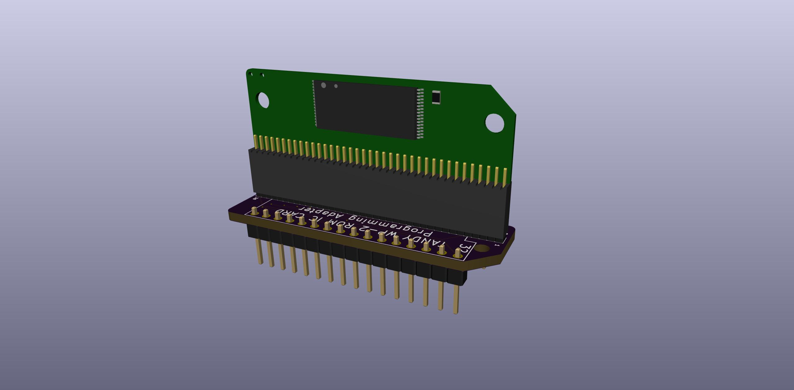  
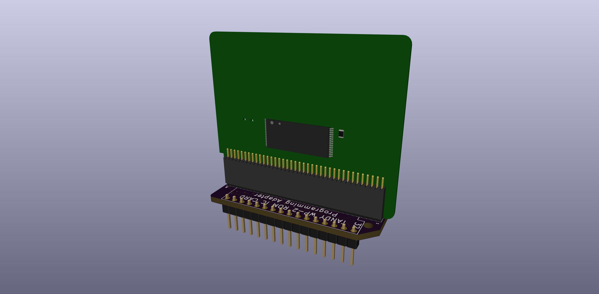  
  

PCB    
[PCB ROM_programming_adapter at OSHPark](https://oshpark.com/shared_projects/wPsaJbVf)  

BOM  
[Parts for ROM_programming_adapter from DigiKey](https://www.digikey.com/short/zn9rqn)

Make a write-enable jumper for the WRITE pads on the ROM IC Cards by taking 2 of the left over 2.54mm pins and solder-bridging the two pins on one side. Pinch the pins together a little to make the fit stiff when plugged into the WRITE holes on the card.

# Reference Material
[WP-2 Manual](https://archive.org/search.php?query=Tandy%20WP-2)  
Contains schematics, pinout, and mechanical drawings of the card and slot.

Pin Socket Header:  
[Original Connectors](ref/JC20-B38S-F1.pdf)  
Datasheet for both the slot in the computer and the connector in the card.  

You can't get the real connector any more, but you can get a generic socket header which fits the pins.  
The pins inside the card slot are 1 row x 38 pins, 1.27mm pitch, 6.0mm long

SAMTEC 8.5mm Pin Socket  
<https://duckduckgo.com/?q=SMS-138-01>  
<https://www.digikey.com/en/products/detail/samtec-inc/SMS-138-01-G-S/9773732>  
<https://www.mouser.com/ProductDetail/Samtec/SMS-138-01-G-S>  

There are less expensive generic female 1.27mm pitch pin headers on ebay and aliexpress etc, but they don't work for this. Sorry :/

PCB:  
The carrier needs 0.8mm thick PCBs instead of the standard 1.6mm.

The "..._B" PCBs need to be 1.2mm or thinner, not the standard 1.6mm. May use the 0.8mm option from OSHPark. JLCPCB has 1.2mm.  

The programing adapter has no special needs.  

RAM:  
Compatible Specs: SRAM, 128Kx8, 5v, Parallel, TSOP-32 (8x20mm) or sTSOP-32 (8x14mm)  
Several parts are compatible. Several examples are listed in the schematic, and the BOM links include a compatibe part.  Here are some pre-loaded searches:  
[DigiKey](https://www.digikey.com/short/zw38nv)  
[Mouser](https://mou.sr/2GcUWHl) (many of the pictures are wrong, so ignore the pictures)  

ROM:  
Compatible Specs: FLASH, 256Kx8, 5v, Parallel, TSOP-32 (8x20mm) or sTSOP-32 (8x14mm)  
As with the SRAM, several parts are compatible. A few example part numbers are listed in the schematic, and the BOM links include a compatible part.  

# TODO
CamelFORTH on ROM?  
But how to construct rom image?  

Document how to export gerbers for JLCPCB  

Document how to select the right options in JLCPCB  

Format the battery-backed SRAM version, save a few files on it, then use a temporary manually wired programming adapter (NOT the programming adapter for the ROM board), and use a programmer to dump the contents of the SRAM to examine how the WP-2 uses the RAM.  

Add a 5v power output to power a [MounT](https://github.com/bkw777/MounT) ?
