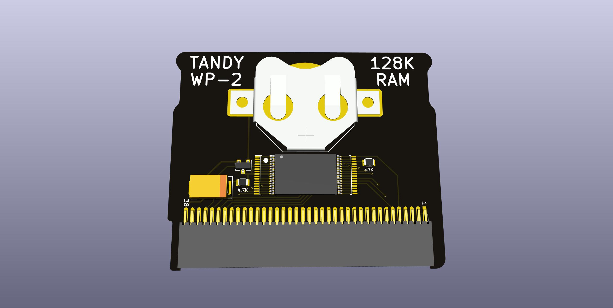
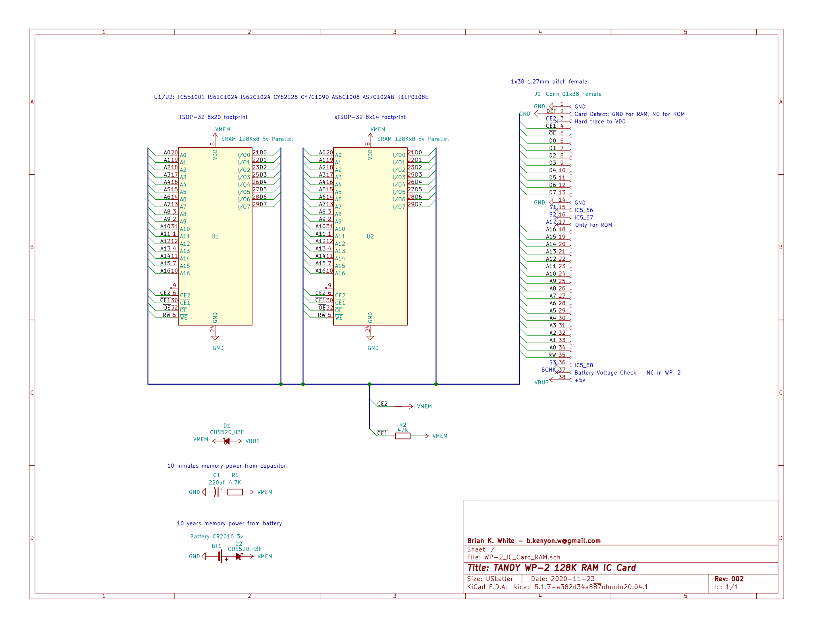
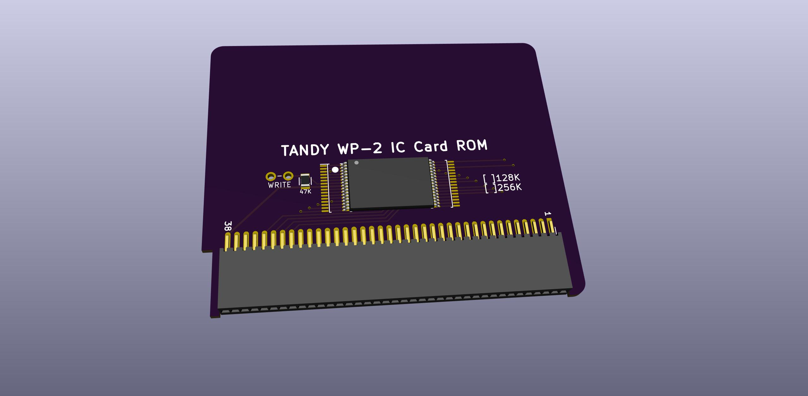
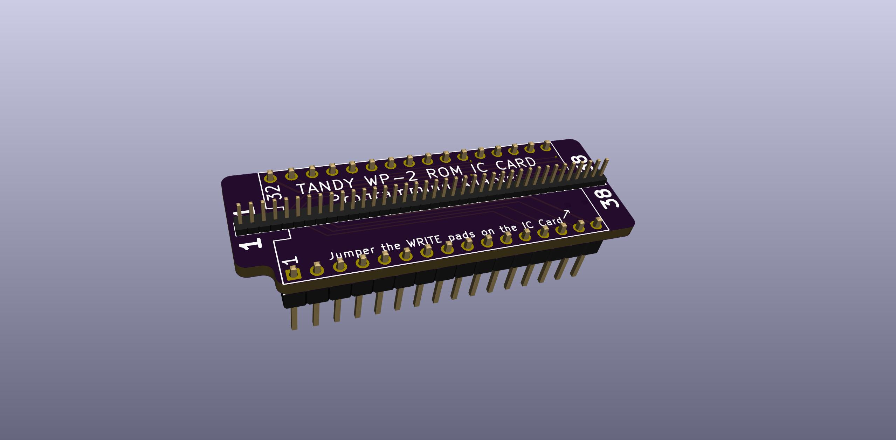
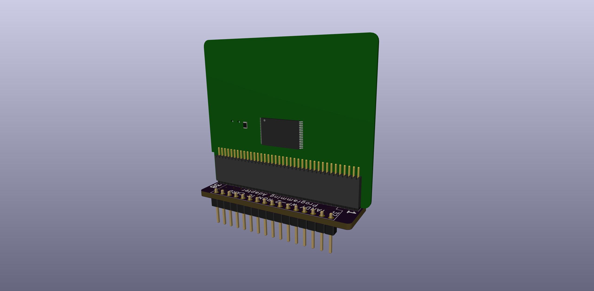
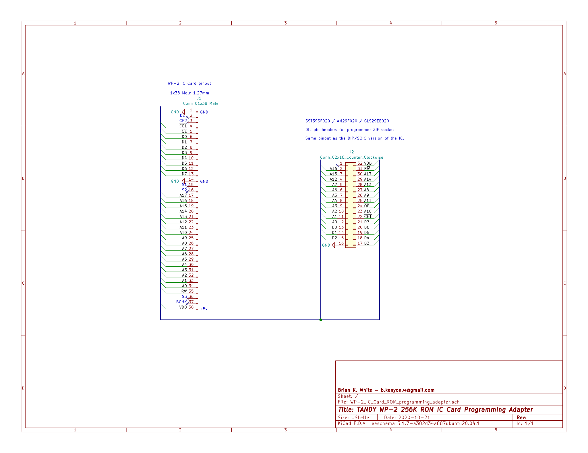

# Expansion IC Card for TANDY WP-2

The TANDY WP-2 has an expansion slot that accepts "IC Cards" that may be either RAM or ROM, up to 128K RAM, up to 256K ROM. Here are two cards to fit that slot, a RAM card and a ROM card, and a programming adapter to program the ROM card. The RAM card includes a battery backup.

Both cards must be made from a thinner PCB than the standard 1.6mm.  
The RAM or ROM card may be up to 1.2mm thick.  

## RAM CARD  

Requires a thinner PCB than normal.  
PCB may be up to 1.2mm thick.

  
  

[RAM card PCB from OSHPark](https://oshpark.com/shared_projects/MVe8vNnX) (Select 0.8mm PCB thickness)  
[RAM card PCB from PCBWAY](https://www.pcbway.com/project/shareproject/WP_2_RAM_IC_Card.html) (Select 1.2mm PCB thickness and ENIG surface finish)

[RAM card BOM from DigiKey](https://www.digikey.com/short/477d2q)

## ROM CARD

Requires a thinner PCB than normal.  
PCB may be up to 1.2mm thick.

  
  

[ROM card PCB from OSHPark](https://oshpark.com/shared_projects/F9gte3be) (Select 0.8mm PCB thickness)  
[ROM card PCB from PCBWAY](https://www.pcbway.com/project/shareproject/WP_2_ROM_IC_Card.html) (Select 1.2mm PCB thickness)  

[ROM card BOM from DigiKey](https://www.digikey.com/short/zn95jj)

## ROM Programming Adapter
Use with a standard eprom programmer such as TL-866, to write to the ROM card.  
Can also be used to read (but not write) the RAM card.

  
  
  

[ROM Card programming adapter PCB from OSHPark](https://oshpark.com/shared_projects/tvMoYMrG)  
[ROM Card programming adapter PCB from PCBWAY](https://www.pcbway.com/project/shareproject/WP_2_IC_Card_ROM_programming_adapter.html)

[ROM Card programming adapter BOM from DigiKey](https://www.digikey.com/short/zv3j4c)

In addition to soldering the pins to the PCB, also make a male jumper for the write-enable holes.  
Take 2 of the left over large pins and solder-bridge the two pins on one side.  
There is a spot to store the jumper on the programming adapter when not in use.  

To program the ROM card, insert the jumper into the write-enable holes on the ROM card.

# Reference Material
[WP-2 Owner & Service Manuals](https://archive.org/search.php?query=Tandy%20WP-2)  
Card slot signals & usage: Service Manual 8-2, C-3.  
Executable "RUN" files: Service Manual 4-16, D-1.  

### Pin Socket Header:  
[Original Connectors](ref/JC20-B38S-F1.pdf)  
Datasheet for both the slot in the computer and the connector in the card.  

You can't get the real connector any more, but you can get a generic socket header which fits the pins.  
The pins inside the card slot are 1 row x 38 pins, 1.27mm pitch, 6.0mm long

SAMTEC 8.5mm Pin Socket  
<https://duckduckgo.com/?q=SMS-138-01>  
<https://www.digikey.com/en/products/detail/samtec-inc/SMS-138-01-G-S/9773732>  
<https://www.mouser.com/ProductDetail/Samtec/SMS-138-01-G-S>  

There are less expensive generic female 1.27mm pitch pin headers on ebay and aliexpress etc, but they don't work for this. Sorry :/

### RAM chip:  
Compatible Specs: SRAM, 128Kx8, 5v, Parallel, TSOP-32 (8x20mm) or sTSOP-32 (8x14mm)  
Several parts are compatible. Several examples are listed in the schematic, and the BOM links include a compatibe part.  Here are some pre-loaded searches:  
[DigiKey](https://www.digikey.com/short/zw38nv)  
[Mouser](https://mou.sr/2GcUWHl) (many of the pictures are wrong, so ignore the pictures)  

### ROM chip:  
Compatible Specs: FLASH, 256Kx8, 5v, Parallel, TSOP-32 (8x20mm) or sTSOP-32 (8x14mm)  
As with the SRAM, several parts are compatible. A few example part numbers are listed in the schematic, and the BOM links include a compatible part.  

### Notes about some of the card slot signals:  

Pin 2, /DET Card Detect: WP-2 uses to detect the type of card. The pin has a pullup to VDD inside the WP-2. A RAM card should connect this pin to GND, which tells the WP-2 that it is a RAM card. A ROM card should leave this pin not connected, which means it will be pulled high by the pullup resistor inside the WP-2, which tells the WP-2 that it is a ROM card.

Pin 3, CE2, active-high chip-enable: CE2 is not actually an inverse copy of /CE1 and does not actually change state. It's wired directly to VDD inside the WP-2. Since it's not actually switched, it's not the best way to enable/disable the IC, even if the SRAM chip has a CE2 pin. It would work, just that the IC would be enabled 100% of the time that the card was inserted and the WP-2 was powered on. These PCBs don't connect CE2 from the WP-2. They do hardwire the CE2 pin on the SRAM chip to VMEM right on the card.

Pin 15 -> RA5 -> IC5 pin 66, "S1"  
Pin 16 -> RA5 -> IC5 pin 67, "S2"  
Pin 36 -> RA5 -> IC5 pin 68, "S3"  

RA5 is 100k pullup to VDD.  
IC5 is a gate array with unknown programming.  
The service manual says pins 15, 16, 36 have no connection in the original IC Cards.

Pin 17, A17: Only used for ROM. RAM may only go up to 128K. ROM may go to 256K. The RAM card does not connect A17. The ROM card does.

Pin 37, BCHK/Vchk, Battery Voltage Check: Unknown usage. The schematic on service manual page 8-2 doesn't show Vchk connecting to anything, and I also cannot find anything anywhere on the motherboard that connects to the pin. These PCBs don't connect this pin.  

### Reading the RAM card:  
You can read out the contents of the RAM card onto a modern pc by using the ROM card programming adapter.

Tell the programmer to ignore the chip ID and assume the device is a 29F010 or pin-compatible, Example: SST39SF010A. IE: a 128K version of the 256K flash chip on the ROM card.

You can only read, NOT write.

Example for a TL-866 programmer using the "minipro" util, to read the ram card and save a copy to a file named `ram.bin`:

`minipro --skip_id --device SST39SF010A --read ram.bin`

# TODO
CamelFORTH on ROM?  
But how to construct rom image? Same as RAM?

Document how to export gerbers for JLCPCB/PCBWAY/etc  

Document how to select the right options in JLCPCB/PCBWAY/etc  

Add a 5v power output to power a [MounT](https://github.com/bkw777/MounT) ?
