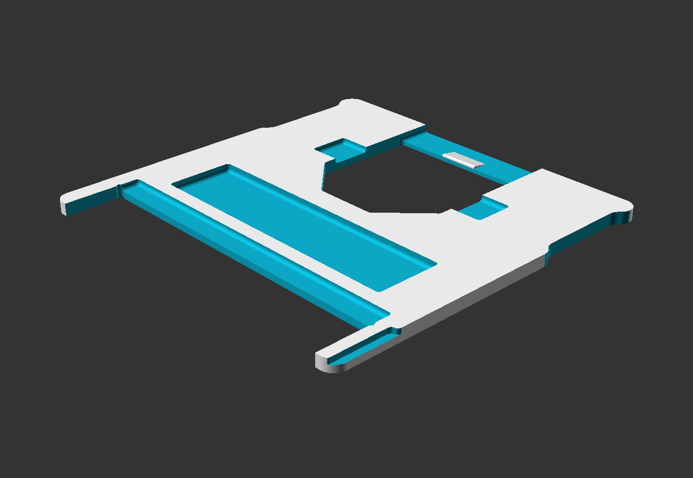

# Expansion IC-Card for [TANDY WP-2](tandy.wiki/WP-2), [TANDY WP-3](https://www.retrocoding.uk/tandy-wp-3-word-processor/), [Citizen CBM-10WP](http://mo5.com/musee-machines-cbm10wp.html), [NTS WP-10C](https://munk.org/typecast/2020/09/09/tandy-wp-2-user-manual-happy-septandy/)

The TANDY WP-2 and other clones of the Citizen CBM-10WP have an expansion slot that accepts ["IC Cards"](#reference-material).

Here are a few different cards to fit that slot.  
* A [battery-backed RAM card](#battery-backed-sram-card) (same as the original cards)  
* A [non-volatile RAM card](#m-ram-512k-card) that needs no battery  
* A [ROM card](#rom-card) (of only academic value, since there are no known ROM card images)  
* A [programming adapter](#programming-adapter) that can read and write both the RAM and ROM cards  
* A [breakout card](#breakout-card) to allow connecting the bus to a breadboard

**These cards must be made with 1.2mm PCB or thinner**  
Standard / default PCB thickness is 1.6mm. This does not fit. Don't miss this step when ordering. I can't create a purchase link that pre-loads this setting. The default will always be 1.6mm and you must remember to manually change it yourself.  
PCBWay and JLCPCB and others have options for exactly 1.2mm pcb thickness.  
OSHPark does not offer exactly 1.2mm, but they do have a 0.8mm option, and you may use that. It's a little trickier to solder the connector on the 0.8mm pcb bacause the pcb and connector do not rest flush on a table surface, but it's still possible, and the board is still perfectly strong enough.  
The programming adapter is not included in this rule and may be standard 1.6mm.

There is an optional top cover that you can 3d-print to protect the components and fill out the slot so the card doesn't wiggle in the slot.  
Attach the cover with thin adhesive tape or glue. I used https://amazon.com/dp/B06Y34587N It's a gummy acrylic adhesive with no tape layer, just a single layer of adhesive. It's thin, but just thick enough to make good contact with the imperfect 3d-printed part, and gummy enough to stick to nylon SLS printed parts, and should not dry out quickly. Yet it's weak enough to be peeled back off without damaging either part if needed. Since there is no tape layer in the middle, you can lay it right over components without having to carefully cut little pieces that fit only in the flat surface areas. When you press the top cover on, the adhesive squishes around the parts and cavities like glue.  

Gerbers and STLs are in [releases](../../releases/)

[pictures](https://photos.app.goo.gl/M8KbMLbY8BXGH7LL8)

----

## Battery-backed SRAM CARD  
<!-- [RAM card PCB from OSHPark]() (Select 0.8mm PCB thickness)  -->
[RAM card PCB from PCBWAY](https://www.pcbway.com/project/shareproject/WP_2_RAM_IC_Card.html)  
IMPORTANT, when ordering the PCB:  
* **Thickness: 1.2** <-- MOST IMPORTANT - DO NOT MISS  
* **Min Track/Spacing: 6/6mil**  
6mil is the default quality level that they can manufacture, but finer detail is available for higher cost. The site tries to automatically scan the design and select the necessary quality level automatically, but it gets this wrong sometimes. All traces and spaces on this board are 0.2mm minimum, almost 7.9mil, so the board only needs the default 6mil quality level. Just manually change it to 6/6 if it isn't already.
* **Surface Finish: Immersion gold(ENIG)**  
Makes it expensive, but you want the battery terminal to be gold.
* **Other Special request: Bottom solder mask full cover.**  
There are no openings in the bottom soldermask layer, so you have to tell them that you want 100% coverage rather than 0% coverage.

The pcb **is** designed to minimized the risk of shorting as much as possible, to minimize the risk of losing the data while the card is loose outside of the WP-2, where the soldermask can get scratched up and metal objects can touch it.  
* There are no VBAT or VBUS traces on the bottom surface.
  There are on the top surface, but the top surface is more protected from direct contact by the various components soldered to it.  
  And the top surface is especially protected if you add the 3d-printed top cover of course.  
* There are two plated vias with VBAT exposed on the bottom, but their exposure is minimized as much as possible.  
  They are drawn with no anular rings at all, and there is extra empty space around them in the ground pour.  
But the chance is still there since the soldermask can't fully tent the hole, and even if it could, the soldermask is still easily scratched, and the bottom surface will naturally suffer the most wear. Plus the entire top of the battery holder is the positive terminal.
So, it is recommended to cover the bottom pcb with a piece of shipping or packing tape. Just lay a single 2-inch piece right across the middle and don't worry about the small bit of uncovered pcb on either side. It will cover all traces and both of the vias in the battery holder solder pads, and the exposed bits are all just ground pour.

[RAM card BOM from DigiKey](https://www.digikey.com/short/5wtbz75z)  

  
  
  
  
  

----

## M-RAM 512K Card

RAM card without a battery!

First, warning, this card is expensive. The MRAM chip is over $33 by itself. The 38-pin connector is over $9. The total BOM cost is over $50 before tax or shipping and not including the PCB or the 3d-printed top cover. The total including PCBs, cover, tax, & shipping is over $100!

But it provides 4 128K banks in a single card, and preserves the data without a battery.  
Having no battery is not merely more convenient. The data is also safer, since there is no risk of losing data from a short from scratched up soldermask and touching metal objects while the card is kicking around in a pocket outside of the WP-2.

[MRAM-512 card PCB from PCBWAY](https://www.pcbway.com/project/shareproject/512k_MRAM_IC_Card_for_TANDY_WP_2_30f542a7.html)  
[MRAM-512 BOM.xls](WP-2_IC-Card_MRAM_512.Mouser.BOM.xls?raw=true) from Mouser because DigiKey doesn't have the 16827 in single quantities

There are two versions of 3d-printable cover available, with different ways to handle the bank-select switch.  
The default version has a separate moving part to move the switch, but it's tiny and a little finnicky to print and clean up and make fit.  
The "dish" version just has a dish shaped concave opening around the switch so you can finger it directly the same as with no cover. But this can be difficult to print cleanly because of the overhang.

  
  
  
  

----

## ROM CARD  
There are no known rom images for any rom cards. Don't bother building one of these unless you are trying to create a rom from scratch.

<!-- [ROM card PCB from OSHPark](https://oshpark.com/shared_projects/F9gte3be) (Select 0.8mm PCB thickness)  -->
[ROM card PCB from PCBWAY](https://www.pcbway.com/project/shareproject/WP_2_ROM_IC_Card.html) (Select 1.2mm PCB thickness)  

[ROM card BOM from DigiKey](https://www.digikey.com/short/zn95jj)

  
  

----

## Programming Adapter
The programming adapter supports both ROM and RAM cards.  
Use with a standard eprom programmer such as TL-866.  

[Programming Adapter PCB from OSHPark](https://oshpark.com/shared_projects/TkzNwgho)  
[Programming Adapter PCB from PCBWAY](https://www.pcbway.com/project/shareproject/TANDY_WP_2_IC_Card_Programming_Adapter.html)

[Programming adapter BOM from DigiKey](https://www.digikey.com/short/v2r3pqp4)

In addition to soldering the pins to the PCB, also make a male jumper for the write-enable contacts on the card.  
Cut a pair of pins off the leftover 2.54mm pin header, and solder-blob the two pins together on the short side.  
There is a spot to stow the jumper on the programming adapter when not in use.  

  
  
  
  

### To program the ROM card

Insert the male jumper into the write-enable holes on the card.

Set all 4 jumpers on the programming adapter to ROM.

Example using a TL-866 programmer to write a file named `rom.bin` to the ROM card:  
`minipro --device SST39SF020A --write rom.bin`

<!-- old version of the breakout card also had a footprint for the rom chip and some extra pins to enable/disable it -->
<!-- current breakout card no longer has that, this is just for reference -->
<!-- 
### To program the Breakout/ROM card

Same as for ROM card except:

Install a jumper from /CE1 to /CE_IC on the card.  
Install a jumper from R/W to /WE_IC on the card.  (This one takes the place of the male jumper on the normal rom card above)  
Remove jumper from  GND to /DET on the card.  
-->

### Reading/Writing the RAM card

Set all 4 jumpers on the programming adapter to RAM.

Examples using a TL-866 programmer (628128 is a generic part number for the SRAM on the card):  
`minipro --skip_id --device 628128 --read ram.bin`  
`minipro --skip_id --device 628128 --write ram.bin`  

----

## BREAKOUT CARD

[Breakout PCB from OSHPark](https://oshpark.com/shared_projects/4spvX9oV) (Select 0.8mm PCB thickness)  
[Breakout PCB from PCBWAY](https://www.pcbway.com/project/shareproject/TANDY_WP_2_IC_Card_Breakout.html) (Select 1.2mm PCB thickness)  

[Breakout card BOM from DigiKey](https://www.digikey.com/short/323npm39)  

  
  
  

----

# Reference Material
[WP-2 Owner & Service Manuals](https://archive.org/search.php?query=Tandy%20WP-2)  
Card slot signals & usage: Service Manual 8-2, C-3.  
Executable "RUN" files: Service Manual 4-16, D-1.  

### Connector:  
[Original Connectors](ref/JC20-B38S-F1.pdf)  
Datasheet for both the slot in the computer and the connector in the card.  

You can't get the real connector any more, but you can get a generic socket header which fits the pins.  
The pins inside the card slot are 1 row x 38 pins, 1.27mm pitch, 6.0mm long

SAMTEC 8.5mm Pin Socket  
<https://duckduckgo.com/?q=SMS-138-01>  
<https://www.digikey.com/en/products/detail/samtec-inc/SMS-138-01-G-S/9773732>  
<https://www.mouser.com/ProductDetail/Samtec/SMS-138-01-G-S>  

There are much less expensive generic female 1.27mm pin headers on ebay and aliexpress, but they don't work for this. Sorry :/ The metal parts inside the cheap connectors aren't held in place accurately enough, and the pins in the WP-2 hit the edges of the metal parts in female sockets, and no amount of wiggling gets all 38 pins to line up and let the card insert. And trying just risks damaging the pins inside the WP-2. So, the Samtec socket is both deep enough to take the 6mm-long pins, and is manufactured to tight enough tolerances that the pins slot right into the socket with no problems.

### RAM chip:  
Compatible Specs: SRAM, 128Kx8, 5v, Parallel, TSOP-32 (8x20mm) or sTSOP-32 (8x14mm)  
Several parts are compatible. Several examples are listed in the schematic, and the BOM links include a compatibe part.  Here are some pre-loaded searches:  
[DigiKey](https://www.digikey.com/short/zw38nv)  
[Mouser](https://mou.sr/2GcUWHl) (many of the pictures are wrong, so ignore the pictures)  

### ROM chip:  
Compatible Specs: FLASH, 256Kx8, 5v, Parallel, TSOP-32 (8x20mm) or sTSOP-32 (8x14mm)  
As with the SRAM, several parts are compatible. A few example part numbers are listed in the schematic, and the BOM links include a compatible part.  

### Notes about some of the card slot signals:  

Pin 2, /DET Card Detect: WP-2 uses this to detect the type of card. The pin is pulled up to VDD inside the WP-2. A RAM card connects this pin to GND, which tells the WP-2 that it is a RAM card. A ROM card leaves this pin not connected, which means it will be pulled high by the pullup resistor inside the WP-2, which tells the WP-2 that it is a ROM card.

Pin 3, CE2, active-high chip-enable: This is not a real CE2 signal from the WP-2, it's just connected directly to VDD inside the WP-2. The card is only enabled/disabled by /CE1. Some of these designs connect the pin anyway as long as the card is based on a chip that actually has a CE2 pin anyway, because it's possible there is some other machines besides WP-2 that use the same card standard, and possibly one of those might actually use the signal. But for instance the 512K MRAM chip does not have a CE2 pin, and that card does not bother to add logic to impliment it, so the pin is NC on that card.

Pin 15, 16, & 36:

Pin 15 -> RA5 -> IC5 pin 66, "S1"  
Pin 16 -> RA5 -> IC5 pin 67, "S2"  
Pin 36 -> RA5 -> IC5 pin 68, "S3"  

RA5 is 100k pullup to VDD.  

IC5 is a gate array with unknown programming.  

The S1, S2, S3 labels come from a schematic in the service manual. They are not mentioned anywhere else.  

The service manual says the original IC Cards have no connections on any of these pins (that's in the cards, not in the WP-2).  

It is unknown if the WP-2 does anything at all with these pins. They are connected to a chip, and the chip is a gate array that could be programmed to do anything. The only clues are that the pins are actually connected to anything at all instead of NC, and that they are pulled up rather than down or floating. It suggests there was a possible reserved usage, and that it was an active-low signal, and that possibly software could do it on the existing hardware.
One guess for pins 15 & 16 might be made purely from their position on the connector. Possibly the spec for the "Toshiba IC-Card" interface includes pins for A18 and A19 that the WP-2 just doesn't happen to use. But the pullups hint against that. Address lines are active high, and so if these pins were un-used or reserved future-use address lines, they should be pulled *down* not up.

Pin 17, A17: Only used for ROM. the WP-2 only supports up to 128K in a RAM card.

Pin 37, BCHK/Vchk, Battery Voltage Check: Unknown usage, but probably originally intended for the WP-2 (or the Citizen CBM-10WP) to detect the level of the battery in a RAM card. The schematic on service manual page 8-2 doesn't show Vchk connecting to anything, and I also cannot find anything anywhere on the motherboard that has continuity with this pin. Other similar machines had a pin that was used for the host machine to read the level of the battery on a RAM card. See the VBB pin in [Atari Portfolio Technical reference Guide, page 11](https://archive.org/details/atariportfoliotechnicalreferenceguide1989/page/n10/mode/1up).

# TODO
CamelFORTH on ROM?  
But how to construct rom image?  
Try to deduce how a rom is supposed to work by recording the bus while trying to load a dictionary while the breakout board has the /DET pin not connected to GND.

Document how to create a RUN file like CamelFORTH. I don't know myself, but John Hogerhuis did it to make CamelFORTH based on the available info in the service manual, and someone else ported Zork the same way. Figure that out and write some sort of reproduceable toolchain & Makefile template hello world project to create new executables.

Use the programming adapter to dump ram card images and reverse engineer the file format. Possibly eventually add an mcu to the card that can read & write the sram and present a standard usb mass storage interface to a pc.

Add a 5v power output to power a [MounT](https://github.com/bkw777/MounT)?
